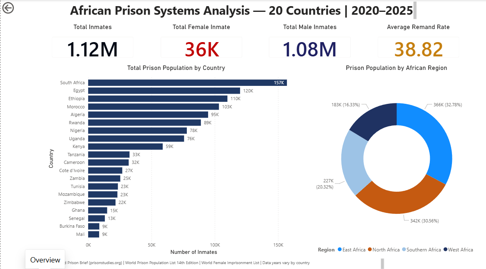
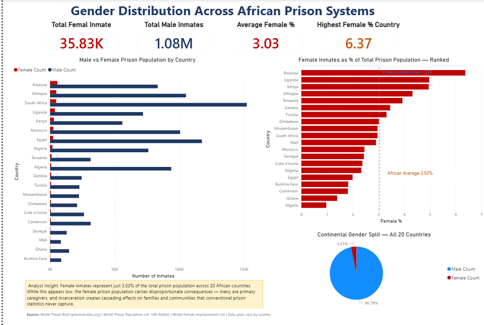
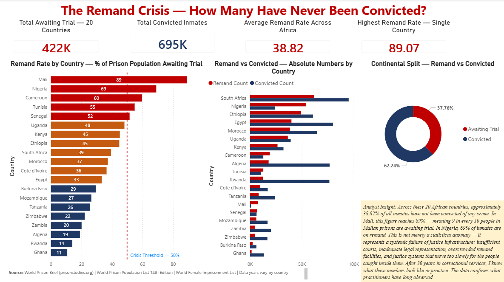
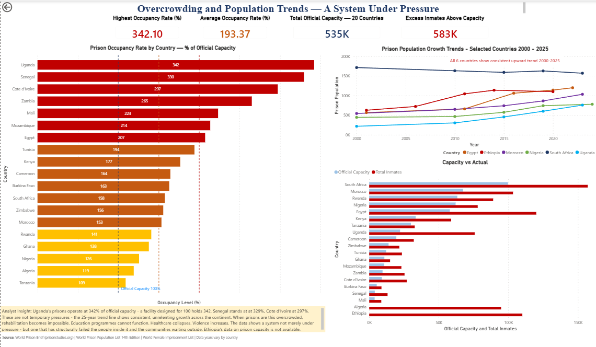
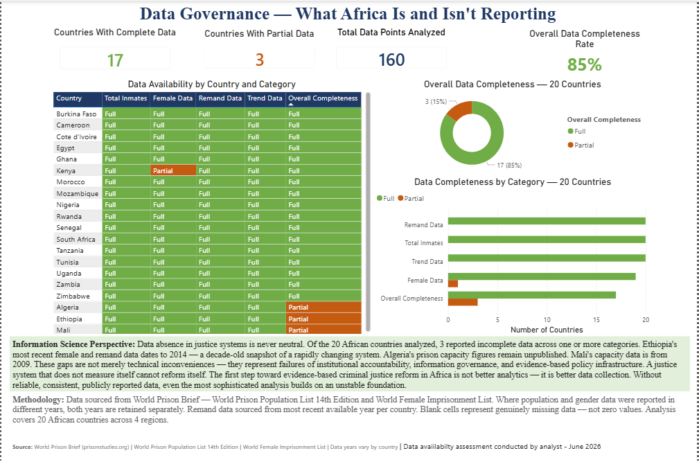

# African Prison Systems Analysis
## A Power BI Dashboard | 20 Countries | 2000–2025

### Page 1 — Overview

### Page 2 — Gender Analysis

### Page 3 — The Remand Crisis

### Page 4 — Overcrowding and Trends

### Page 5 — Data Governance

---

## Project Overview

A comprehensive analytical dashboard examining prison 
systems across 20 African countries, covering:

- Total prison population scale and regional distribution
- Gender distribution across African prison systems
- The remand crisis — inmates awaiting trial without conviction
- Overcrowding levels and 25-year population trends
- Data governance — what Africa is and isn't reporting

---

## Key Findings

| Finding | Value |
|---------|-------|
| Total inmates — 20 countries | 1,117,503 |
| Average occupancy rate | 193.37% |
| Average remand rate | 38.82% |
| Mali remand rate | 89.07% |
| Uganda occupancy rate | 342.10% |
| Female inmates continental share | 3.03% |

---

## Files in This Repository

| File | Description |
|------|-------------|
| African_Prison_Systems_Analysis.pbix | Power BI dashboard file |
| African_Prisons.xlsx | Cleaned dataset — 3 sheets |
| Screenshots/ | Dashboard page images |

---

## Tools Used

- Microsoft Power BI Desktop
- Microsoft Excel
- DAX (Data Analysis Expressions)
- Power Query

---

## Data Sources

- World Prison Brief — prisonstudies.org
- World Prison Population List — 14th Edition
- World Female Imprisonment List
- Data years vary by country — see methodology notes

---

## About the Analyst

**Jimoh Sikiru Abiola**
Justice Data Consultant | 30 Years Correctional Services
MSc Information Science — University of Ibadan

This analysis combines three decades of frontline 
correctional experience with Information Science 
methodology and data analytics — bringing a practitioner 
perspective to one of Africa's most underanalyzed 
policy areas.

🔗 LinkedIn: https://www.linkedin.com/in/jimoh-sikiru-abiola/

---

## License
MIT License — free to use with attribution
